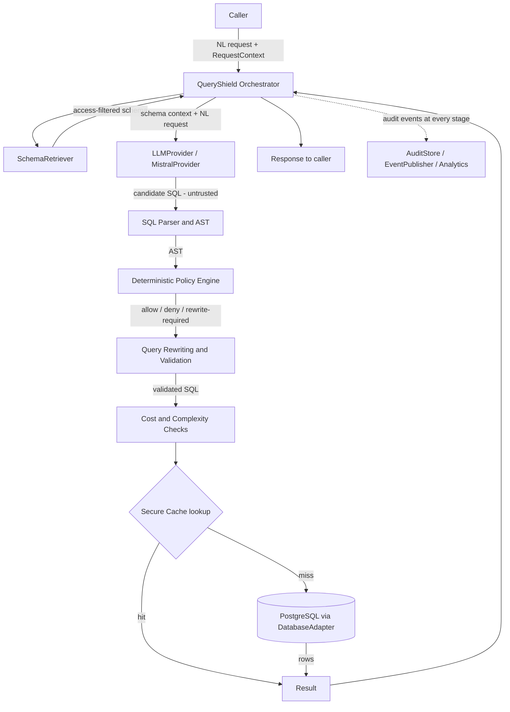
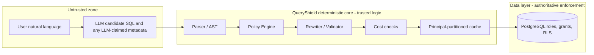

# QueryShield — Architecture

> **Status: Phase 1 (project foundation).** This document describes the
> **intended** architecture. **None of the pipeline components below are
> implemented yet** — Phase 1 adds only the installable project skeleton
> (packaging, tooling, tests, CI), documented in [§11](#11-project-foundation-implemented-in-phase-1).
> Where a distinction matters, planned behavior is called out as *planned*. The
> live build state is tracked in
> [`IMPLEMENTATION_STATUS.md`](IMPLEMENTATION_STATUS.md).

---

## 1. System overview

QueryShield is a controls layer between an LLM that *proposes* SQL and a
PostgreSQL database that *executes* it. The guiding idea is a strict separation
of concerns:

- The **LLM** is a convenience that turns natural language into *candidate* SQL.
  It is untrusted.
- **QueryShield** is deterministic, auditable logic that decides whether and how
  candidate SQL may run.
- **PostgreSQL** is the authoritative enforcement layer via roles, privileges,
  and row-level security (RLS).

A single public operation — "answer this natural-language question against this
database, for this principal" — is realized as a fixed pipeline of stages, each
with a narrow responsibility and a typed input/output.

---

## 2. Execution pipeline



**Stage ordering notes**

- **Audit spans the whole pipeline.** Each stage emits structured events;
  denials and errors are audited too, not just successes.
- **Cache lookup happens after validation and cost checks**, keyed on the
  *validated* SQL plus the full principal context plus a schema version. This
  guarantees a cached result always corresponds to a policy-approved query and
  can never cross principals. An optional upstream NL→SQL cache (short-circuit
  the LLM) is a documented *future extension point*, not part of the core path.
- **Deny is terminal.** On a policy deny or a fail-closed error, the pipeline
  stops, audits, and returns a structured error — it never degrades to a
  weaker check.

---

## 3. Component responsibilities

| Component | Responsibility | Trust |
|-----------|----------------|-------|
| **Orchestrator** (`QueryShield`) | Owns the pipeline, threads `RequestContext`, enforces fail-closed semantics, assembles the result and audit record. | Trusted |
| **SchemaRetriever** | Dynamically introspects the target database (`information_schema` / `pg_catalog`), returns an **access-filtered** schema view for the principal, caches it with a version. Never a static schema. | Trusted |
| **LLMProvider** (`MistralProvider`) | Builds a prompt from the NL request + retrieved schema and returns candidate SQL. Stateless w.r.t. security. | **Untrusted output** |
| **SQL Parser / AST** | Parses candidate SQL into a structured AST using a real SQL grammar. Rejects unparseable input (fail-closed). | Trusted |
| **Policy Engine** (`PolicyRule`s) | Evaluates the AST against configured, pluggable rules and returns a structured decision. No regex soup, no hard-coded table lists. | Trusted |
| **Rewriter / Validator** | Applies deterministic, policy-mandated transforms (e.g., enforced `LIMIT`, tenant predicates) and **re-parses** to confirm invariants. | Trusted |
| **Cost / Complexity Checks** | Static complexity analysis plus optional planner cost via `EXPLAIN` (never `EXPLAIN ANALYZE`), compared to configured thresholds. | Trusted |
| **CacheBackend** (`RedisCache` / `InMemoryCache`) | Stores/returns results under a **principal-partitioned** key with a configurable TTL. | Trusted, isolated |
| **DatabaseAdapter** (`PostgreSQLAdapter`) | Executes validated SQL under a principal-mapped, least-privilege role in a read-only transaction with a `statement_timeout`. | Trusted gateway to authoritative layer |
| **PostgreSQL** | Final enforcement: roles, grants, RLS. | **Authoritative** |
| **AuditStore** | Persists append-only, structured audit records (incl. denials/errors). | Trusted |
| **EventPublisher** | Emits pipeline events to downstream analytics/streaming sinks. | Trusted |

---

## 4. Trust & security boundaries



**Boundary rules**

- Everything the user types and everything the LLM returns is **untrusted** and
  crosses into the trusted core only as a *string to be analyzed*, never as a
  decision.
- The **trusted core** derives all security verdicts deterministically from the
  AST and from configuration/`RequestContext`. It must contain no code path
  that consults the LLM for a safety judgment.
- The **data layer** is authoritative. Even a bug in the core must not grant
  access the database role would refuse. This is why callers map to
  least-privilege DB roles rather than everything running as a superuser.
- The **cache** lives inside the trusted core but is a potential cross-tenant
  leak vector; its key derivation (principal + validated query + schema
  version) is itself a security control and is unit-tested as one.

**Fail-closed matrix (planned defaults)**

| Failure | Default behavior | Overridable? |
|---------|------------------|--------------|
| Candidate SQL will not parse | Deny | No (unparseable == unanalyzable) |
| Policy engine raises | Deny | No |
| Required rewrite cannot be proven safe | Deny | No |
| Cost check backend unavailable | Deny | Yes, via explicit config |
| Cache backend unavailable | Bypass cache, continue (never serve stale/foreign) | Yes, via explicit config |
| Audit sink unavailable | Deny *or* degrade — explicit config, no silent loss | Yes, via explicit config |

---

## 5. The `RequestContext` (security principal)

A single typed object, supplied by the trusted caller at request time, carries
the identity and limits for one request and flows through every stage:

- tenant identifier(s)
- user identifier
- role(s) / grants used to filter schema and to select the DB role
- database/connection selector (QueryShield supports **many** databases)
- optional per-request overrides for limits/timeouts (bounded by config)

It is **never** derived from LLM output. Cache keys, audit records, and DB
sessions are all scoped by it. (*Planned; exact fields finalized in the
implementation phases.*)

---

## 6. Major interfaces (planned)

Concrete implementations named in parentheses are the intended first ones; the
core depends only on the abstractions.

- **`LLMProvider`** → `generate_sql(nl_request, schema_context, ctx) -> CandidateSQL`
  *(MistralProvider)*
- **`SchemaRetriever`** → `get_schema(ctx) -> SchemaView` (access-filtered,
  versioned, cacheable)
- **`DatabaseAdapter`** → connection/role management + `execute(validated_sql, ctx)`
  and `explain(validated_sql, ctx)` *(PostgreSQLAdapter)*
- **`PolicyRule`** → `evaluate(ast, schema, ctx) -> PolicyDecision`; composed by
  a `PolicyEngine`
- **`CacheBackend`** → `get(key)` / `set(key, value, ttl)` with
  principal-partitioned keys *(RedisCache, InMemoryCache)*
- **`AuditStore`** → `record(audit_record)` append-only
- **`EventPublisher`** → `publish(event)` to analytics/streaming sinks

Supporting types (planned): `RequestContext`, `SchemaView`, `CandidateSQL`,
`PolicyDecision`, `PipelineResult`, `AuditRecord`, and a typed error hierarchy
(e.g., `QueryShieldError` → `ParseError`, `PolicyDenied`, `CostExceeded`,
`ExecutionError`, `ConfigError`).

---

## 7. Configuration model (planned)

A single validated configuration object (intended: `pydantic-settings`),
resolved with a clear precedence:

```
built-in safe defaults  <  config file  <  environment variables  <  per-request RequestContext overrides (bounded)
```

Everything in the [Development rules](../CLAUDE.md#5-development-rules)
"no hard-coding" list is sourced here or from `RequestContext`. Configuration is
validated at startup; invalid config is a startup error (fail-closed), not a
runtime surprise.

---

## 8. Dependency relationships

- The **Orchestrator** depends on the seven interfaces, not on vendors. Vendors
  (Mistral, Redis, a specific driver) are wired at the edges via dependency
  injection / a composition root.
- The **deterministic core** (parser, policy, rewriter, cost) depends on the
  AST and config only — not on the LLM, not on the network.
- The optional **HTTP API** (FastAPI) is a thin adapter over the library core;
  the library is usable without it.

---

## 9. Future extension points

- Additional `LLMProvider`s (the core must never assume Mistral specifics).
- Additional `DatabaseAdapter`s. The initial and only committed target is
  PostgreSQL; the abstraction exists so the dialect/engine is not welded into
  the core.
- Additional `PolicyRule`s loaded from configuration (deny-by-default base +
  pluggable rules).
- Additional `CacheBackend`s and `AuditStore`s / `EventPublisher`s.
- Upstream NL→SQL cache to short-circuit the LLM (must preserve principal
  partitioning and schema versioning).

---

## 10. Known architectural risks (tracked, not yet mitigated)

- **Parser differential:** if the parsing library's grammar diverges from
  PostgreSQL's, a query could pass QueryShield's analysis but execute
  differently. Mitigation strategy and library choice are tracked in
  [`DECISIONS.md`](DECISIONS.md). The data-layer (least-privilege role + RLS)
  is the backstop.
- **Schema staleness:** cached schema could lag DDL changes; schema versioning
  and TTL mitigate this (details deferred to the schema-retrieval phase).
- **Prompt/response handling:** candidate SQL may contain hostile content;
  because it is only ever parsed and analyzed (never trusted), this is contained
  by design, but logging/audit must avoid echoing secrets.

---

## 11. Project foundation (implemented in Phase 1)

Everything in §§1–10 is still *planned*. This section documents what the
repository **actually** contains today, so this document never overstates
reality.

Phase 1 established an installable, type-checked, testable Python project — and
nothing more:

- **Packaging:** PEP 621 `pyproject.toml` with the **Hatchling** build backend
  (ADR-0011). The version is dynamic, sourced from `__version__` in
  `src/queryshield/__init__.py` (the single source of truth).
- **Package:** `src/queryshield/` contains only `__init__.py` (exposing
  `__version__`) and a `py.typed` marker (PEP 561). There is **no**
  orchestrator, interface, model, or pipeline component yet.
- **Runtime dependencies:** none (ADR-0012). Dev tooling (`pytest`,
  `pytest-cov`, `ruff`, `mypy`) is an optional `dev` group.
- **Tests:** `tests/unit/test_package.py` asserts real packaging invariants
  (import works, version is well-formed, the in-code version matches the
  installed distribution metadata, public API is minimal).
  `tests/integration/` is a documented placeholder for Phase 2 (ADR-0013).
- **Quality gate:** `ruff` (lint + format) and `mypy --strict`, enforced in CI
  across Python 3.11–3.13 with no service containers (ADR-0014).
- **Configuration convention:** `.env.example` documents the environment
  variables later phases will consume. **No code reads it yet**; the validated
  configuration model described in [§7](#7-configuration-model-planned) is not
  implemented.

How this maps onto the target architecture: the foundation is the empty vessel
for §§1–10. The composition root, the seven interfaces ([§6](#6-major-interfaces-planned)),
the `RequestContext` ([§5](#5-the-requestcontext-security-principal)), and the
configuration model ([§7](#7-configuration-model-planned)) are the **next**
increment (the "core library skeleton"); the deterministic pipeline
([§§2–4](#2-execution-pipeline)) follows after that. No shortcut has been taken
that pre-commits any of those designs.
