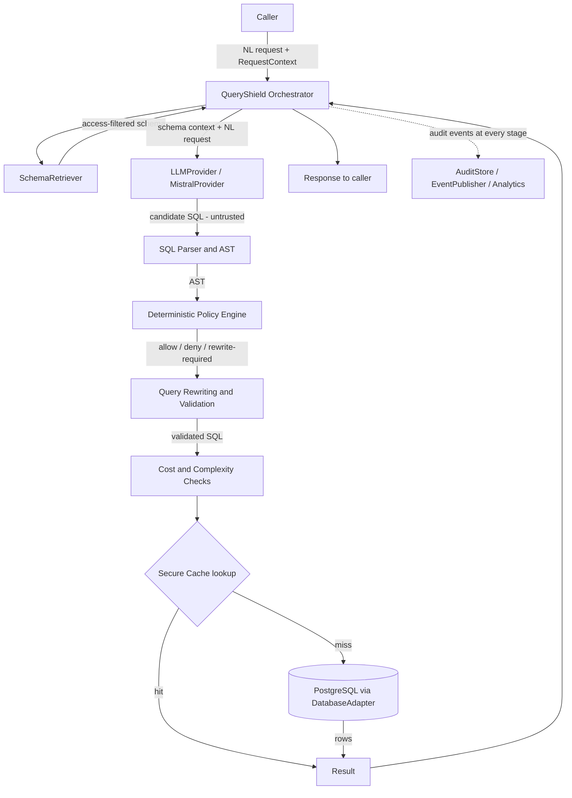
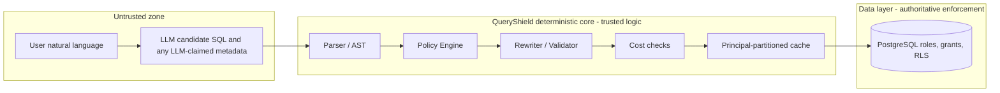
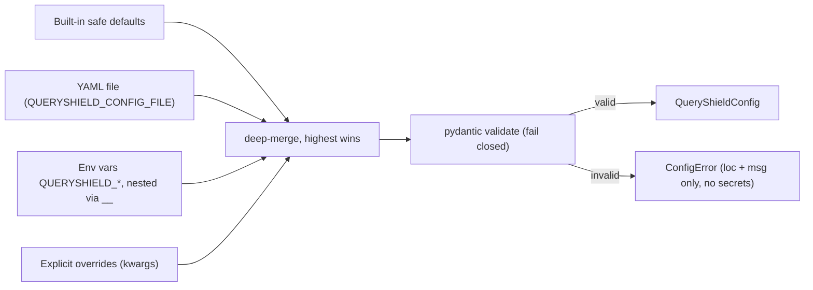
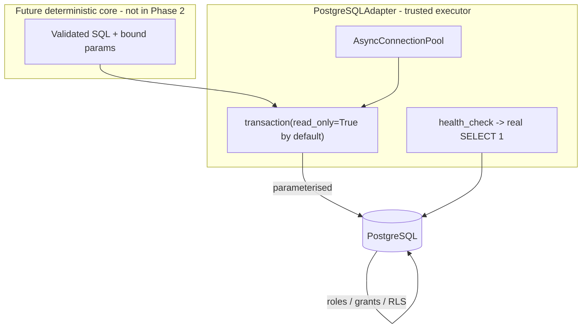
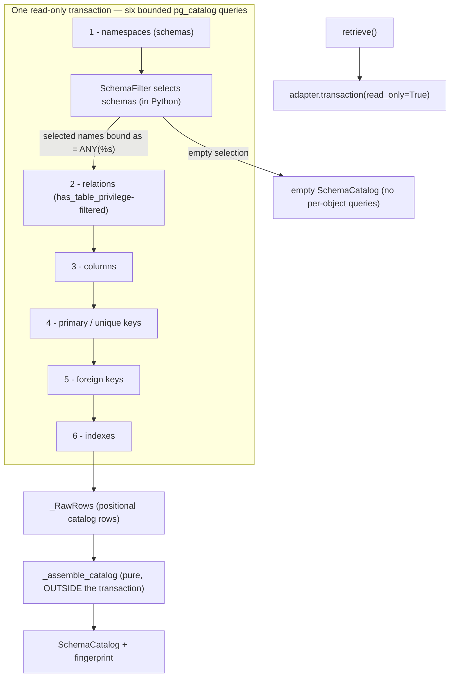

# QueryShield — Architecture

> **Status: Phase 3 (dynamic PostgreSQL schema introspection).**
> This document describes the **intended** end-state architecture. Three
> foundations are now implemented — the **configuration system**
> ([§7](#7-configuration-system-implemented-in-phase-2)), the **database
> abstraction + PostgreSQL adapter**
> ([§12](#12-phase-2-implementation-configuration-and-database-layer)), and
> **dynamic schema introspection**
> ([§13](#13-phase-3-implementation-schema-introspection)) — together with the
> typed error hierarchy and a library logging handler. **The remaining pipeline
> components are still not implemented**: no LLM provider, SQL parsing/AST,
> policy engine, rewriter, cost checks, secure cache, query execution for
> arbitrary user SQL, or audit. Where a distinction matters, planned behavior is
> called out as *planned*. The live build state is tracked in
> [`IMPLEMENTATION_STATUS.md`](IMPLEMENTATION_STATUS.md).

---

## 1. System overview

QueryShield is a controls layer between an LLM that *proposes* SQL and a
PostgreSQL database that *executes* it. The guiding idea is a strict separation
of concerns:

- The **LLM** is a convenience that turns natural language into *candidate* SQL.
  It is untrusted.
- **QueryShield** is deterministic, auditable logic that decides whether and how
  candidate SQL may run.
- **PostgreSQL** is the authoritative enforcement layer via roles, privileges,
  and row-level security (RLS).

A single public operation — "answer this natural-language question against this
database, for this principal" — is realized as a fixed pipeline of stages, each
with a narrow responsibility and a typed input/output.

---

## 2. Execution pipeline



**Stage ordering notes**

- **Audit spans the whole pipeline.** Each stage emits structured events;
  denials and errors are audited too, not just successes.
- **Cache lookup happens after validation and cost checks**, keyed on the
  *validated* SQL plus the full principal context plus a schema version. This
  guarantees a cached result always corresponds to a policy-approved query and
  can never cross principals. An optional upstream NL→SQL cache (short-circuit
  the LLM) is a documented *future extension point*, not part of the core path.
- **Deny is terminal.** On a policy deny or a fail-closed error, the pipeline
  stops, audits, and returns a structured error — it never degrades to a
  weaker check.

---

## 3. Component responsibilities

| Component | Responsibility | Trust |
|-----------|----------------|-------|
| **Orchestrator** (`QueryShield`) | Owns the pipeline, threads `RequestContext`, enforces fail-closed semantics, assembles the result and audit record. | Trusted |
| **SchemaRetriever** *(implemented — `PostgreSQLSchemaRetriever`, Phase 3)* | Dynamically introspects the target database via `pg_catalog` and returns an immutable `SchemaCatalog` snapshot carrying a deterministic structural fingerprint. Never a static schema. *(Phase 3 filters relations by the configured role's `has_table_privilege`; per-principal access-filtering and caching/versioning are planned.)* | Trusted |
| **LLMProvider** (`MistralProvider`) | Builds a prompt from the NL request + retrieved schema and returns candidate SQL. Stateless w.r.t. security. | **Untrusted output** |
| **SQL Parser / AST** | Parses candidate SQL into a structured AST using a real SQL grammar. Rejects unparseable input (fail-closed). | Trusted |
| **Policy Engine** (`PolicyRule`s) | Evaluates the AST against configured, pluggable rules and returns a structured decision. No regex soup, no hard-coded table lists. | Trusted |
| **Rewriter / Validator** | Applies deterministic, policy-mandated transforms (e.g., enforced `LIMIT`, tenant predicates) and **re-parses** to confirm invariants. | Trusted |
| **Cost / Complexity Checks** | Static complexity analysis plus optional planner cost via `EXPLAIN` (never `EXPLAIN ANALYZE`), compared to configured thresholds. | Trusted |
| **CacheBackend** (`RedisCache` / `InMemoryCache`) | Stores/returns results under a **principal-partitioned** key with a configurable TTL. | Trusted, isolated |
| **DatabaseAdapter** (`PostgreSQLAdapter`) | Executes already-validated SQL inside a transaction (**read-only by default**) with a configurable `statement_timeout`, through a pooled connection. *(Implemented — Phase 2. Principal→least-privilege-role mapping is planned; Phase 2 connects as the single configured DSN role.)* | Trusted gateway to authoritative layer |
| **PostgreSQL** | Final enforcement: roles, grants, RLS. | **Authoritative** |
| **AuditStore** | Persists append-only, structured audit records (incl. denials/errors). | Trusted |
| **EventPublisher** | Emits pipeline events to downstream analytics/streaming sinks. | Trusted |

> **Implemented as of Phase 3:** the **DatabaseAdapter**
> (`PostgreSQLAdapter`), the **configuration system** ([§7](#7-configuration-system-implemented-in-phase-2)),
> the **SchemaRetriever** (`PostgreSQLSchemaRetriever`,
> [§13](#13-phase-3-implementation-schema-introspection)), the typed **error
> hierarchy**, and a library **logging** handler. The adapter is the *trusted
> executor* of already-validated SQL and the retriever only *describes* schema
> structure — neither decides whether a query is authorized; that is the job of
> the (still unimplemented) parser, policy engine, and rewriter. See
> [§12](#12-phase-2-implementation-configuration-and-database-layer),
> [§13](#13-phase-3-implementation-schema-introspection), and the trust-boundary
> docstring in `src/queryshield/db/base.py`. Every other component in this table
> is still *planned*.

---

## 4. Trust & security boundaries



**Boundary rules**

- Everything the user types and everything the LLM returns is **untrusted** and
  crosses into the trusted core only as a *string to be analyzed*, never as a
  decision.
- The **trusted core** derives all security verdicts deterministically from the
  AST and from configuration/`RequestContext`. It must contain no code path
  that consults the LLM for a safety judgment.
- The **data layer** is authoritative. Even a bug in the core must not grant
  access the database role would refuse. This is why callers map to
  least-privilege DB roles rather than everything running as a superuser.
- The **cache** lives inside the trusted core but is a potential cross-tenant
  leak vector; its key derivation (principal + validated query + schema
  version) is itself a security control and is unit-tested as one.

**Fail-closed matrix (planned defaults)**

| Failure | Default behavior | Overridable? |
|---------|------------------|--------------|
| Candidate SQL will not parse | Deny | No (unparseable == unanalyzable) |
| Policy engine raises | Deny | No |
| Required rewrite cannot be proven safe | Deny | No |
| Cost check backend unavailable | Deny | Yes, via explicit config |
| Cache backend unavailable | Bypass cache, continue (never serve stale/foreign) | Yes, via explicit config |
| Audit sink unavailable | Deny *or* degrade — explicit config, no silent loss | Yes, via explicit config |

---

## 5. The `RequestContext` (security principal)

A single typed object, supplied by the trusted caller at request time, carries
the identity and limits for one request and flows through every stage:

- tenant identifier(s)
- user identifier
- role(s) / grants used to filter schema and to select the DB role
- database/connection selector (QueryShield supports **many** databases)
- optional per-request overrides for limits/timeouts (bounded by config)

It is **never** derived from LLM output. Cache keys, audit records, and DB
sessions are all scoped by it. (*Planned; exact fields finalized in the
implementation phases.*)

---

## 6. Major interfaces (planned unless marked implemented)

Concrete implementations named in parentheses are the intended first ones; the
core depends only on the abstractions.

- **`LLMProvider`** → `generate_sql(nl_request, schema_context, ctx) -> CandidateSQL`
  *(MistralProvider)*
- **`SchemaRetriever`** *(implemented — `PostgreSQLSchemaRetriever`)* →
  `retrieve() -> SchemaCatalog`: introspects the live database and returns an
  immutable, fingerprinted snapshot. The planned per-principal signature
  (`get_schema(ctx) -> SchemaView`, access-filtered + versioned + cacheable) is
  deferred until `RequestContext` exists; Phase 3 filters relations by the
  configured role's `has_table_privilege` and does not cache (see
  [§13](#13-phase-3-implementation-schema-introspection)).
- **`DatabaseAdapter`** *(implemented — `PostgreSQLAdapter`)* → async lifecycle
  `open()` / `close()` (also usable as an async context manager),
  `health_check()`, `transaction(*, read_only=True)` yielding a
  `DatabaseSession`, and convenience `execute` / `fetch_all` / `fetch_one` (each
  in its own transaction). All value binding is **parameterised**; read-only is
  the default. Principal→DB-role mapping and an `explain()` for cost checks are
  *planned* (later phases).
- **`PolicyRule`** → `evaluate(ast, schema, ctx) -> PolicyDecision`; composed by
  a `PolicyEngine`
- **`CacheBackend`** → `get(key)` / `set(key, value, ttl)` with
  principal-partitioned keys *(RedisCache, InMemoryCache)*
- **`AuditStore`** → `record(audit_record)` append-only
- **`EventPublisher`** → `publish(event)` to analytics/streaming sinks

Supporting types: the typed error hierarchy is **implemented** (`QueryShieldError`
→ `ConfigError`; `DatabaseError` → `DatabaseConnectionError` /
`DatabaseExecutionError`; and `SchemaError` → `SchemaRetrievalError` /
`SchemaMetadataError`, a branch **separate from** `DatabaseError`); the remaining
pipeline errors are *planned* (`ParseError`, `PolicyDenied`, `CostExceeded`, …).
The schema snapshot type is **implemented** (`SchemaCatalog` and its frozen
member models — [§13](#13-phase-3-implementation-schema-introspection)); the
other data/transport types (`RequestContext`, the per-principal `SchemaView`,
`CandidateSQL`, `PolicyDecision`, `PipelineResult`, `AuditRecord`) are all still
*planned*.

---

## 7. Configuration system (implemented in Phase 2)

A single validated configuration object, built with **pydantic v2** models and
loaded by a small, explicit, deterministic loader in
`src/queryshield/config.py`. We deliberately do **not** use `pydantic-settings`
(ADR-0016); the loader is hand-written so the precedence and the fail-closed
behavior are fully under our control and easy to test.

**Precedence (highest wins):**

```
explicit overrides passed in code  >  environment variables (QUERYSHIELD_*)  >  YAML config file  >  built-in safe defaults
```



- **Namespacing.** All variables use the prefix `QUERYSHIELD_`; nested fields use
  a `__` delimiter (e.g. `QUERYSHIELD_DATABASE__URL` → `config.database.url`).
  See ADR-0017.
- **YAML layer.** `QUERYSHIELD_CONFIG_FILE` points at an optional YAML file,
  parsed with `yaml.safe_load`. It supports `${VAR}` interpolation from the
  environment; an **undefined** `${VAR}` is a fail-closed `ConfigError`, never an
  empty string.
- **Fail-closed validation.** `load_config()` deep-merges the layers and calls
  `QueryShieldConfig.model_validate`. Any invalid or type-wrong
  security-relevant value raises a structured `ConfigError` at load time — it is
  never silently dropped. The `database` section is `extra="forbid"` (a typo'd
  DB key is an error); the root object is `extra="ignore"` (so unrelated
  `QUERYSHIELD_*` variables — e.g. the integration-test DSN — can coexist).
- **Secrets.** `database.url` is a `pydantic.SecretStr`: it never appears in
  reprs, logs, or validation-error output. Validation errors are rendered from
  `loc` + `msg` only — input values are never echoed (ADR-0022).
- **Everything deployment-specific lives here.** Connection URL, pool sizes,
  timeouts, `statement_timeout`, `sslmode`, and log level are all configured,
  each with a documented, overridable safe default. Nothing is hard-coded.

The validated object is passed explicitly to components (e.g. the
`PostgreSQLAdapter` takes a `DatabaseConfig`) — there is no global mutable
config singleton. Per-request `RequestContext` overrides
([§5](#5-the-requestcontext-security-principal)) remain *planned*.

---

## 8. Dependency relationships

- The **Orchestrator** depends on the seven interfaces, not on vendors. Vendors
  (Mistral, Redis, a specific driver) are wired at the edges via dependency
  injection / a composition root.
- The **deterministic core** (parser, policy, rewriter, cost) depends on the
  AST and config only — not on the LLM, not on the network.
- The optional **HTTP API** (FastAPI) is a thin adapter over the library core;
  the library is usable without it.

---

## 9. Future extension points

- Additional `LLMProvider`s (the core must never assume Mistral specifics).
- Additional `DatabaseAdapter`s. The initial and only committed target is
  PostgreSQL; the abstraction exists so the dialect/engine is not welded into
  the core.
- Additional `PolicyRule`s loaded from configuration (deny-by-default base +
  pluggable rules).
- Additional `CacheBackend`s and `AuditStore`s / `EventPublisher`s.
- Upstream NL→SQL cache to short-circuit the LLM (must preserve principal
  partitioning and schema versioning).

---

## 10. Known architectural risks (tracked, not yet mitigated)

- **Parser differential:** if the parsing library's grammar diverges from
  PostgreSQL's, a query could pass QueryShield's analysis but execute
  differently. Mitigation strategy and library choice are tracked in
  [`DECISIONS.md`](DECISIONS.md). The data-layer (least-privilege role + RLS)
  is the backstop.
- **Schema staleness:** a schema snapshot can lag DDL changes. Phase 3 addresses
  this by making the `SchemaCatalog` an explicit point-in-time snapshot with
  **no** implicit caching — every `retrieve()` re-introspects — and by stamping
  each snapshot with a deterministic structural fingerprint so a consumer can
  detect drift. Cache-backed reuse with a schema-version TTL is a *planned*
  optimisation for the layers that will consume the catalog.
- **Prompt/response handling:** candidate SQL may contain hostile content;
  because it is only ever parsed and analyzed (never trusted), this is contained
  by design, but logging/audit must avoid echoing secrets.

---

## 11. Project foundation (implemented in Phase 1)

Most of §§1–10 is still *planned*. The exceptions implemented since — the
configuration system ([§7](#7-configuration-system-implemented-in-phase-2)) and
the database adapter — arrived in Phase 2 and are documented in
[§12](#12-phase-2-implementation-configuration-and-database-layer). This section
records what **Phase 1** delivered, so the history stays honest.

Phase 1 established an installable, type-checked, testable Python project — and
nothing more:

- **Packaging:** PEP 621 `pyproject.toml` with the **Hatchling** build backend
  (ADR-0011). The version is dynamic, sourced from `__version__` in
  `src/queryshield/__init__.py` (the single source of truth).
- **Package:** `src/queryshield/` contains only `__init__.py` (exposing
  `__version__`) and a `py.typed` marker (PEP 561). There is **no**
  orchestrator, interface, model, or pipeline component yet.
- **Runtime dependencies:** none (ADR-0012). Dev tooling (`pytest`,
  `pytest-cov`, `ruff`, `mypy`) is an optional `dev` group.
- **Tests:** `tests/unit/test_package.py` asserts real packaging invariants
  (import works, version is well-formed, the in-code version matches the
  installed distribution metadata, public API is minimal).
  `tests/integration/` is a documented placeholder for Phase 2 (ADR-0013).
- **Quality gate:** `ruff` (lint + format) and `mypy --strict`, enforced in CI
  across Python 3.11–3.13 with no service containers (ADR-0014).
- **Configuration convention:** `.env.example` documented the environment
  variables later phases would consume. In Phase 1 **no code read it**; the
  validated configuration model has since been implemented in Phase 2
  ([§7](#7-configuration-system-implemented-in-phase-2)).

How this maps onto the target architecture: the foundation was the empty vessel
for §§1–10. Phase 2 then filled in the configuration system
([§7](#7-configuration-system-implemented-in-phase-2)) and the database adapter
([§12](#12-phase-2-implementation-configuration-and-database-layer)). The
remaining seven interfaces ([§6](#6-major-interfaces-planned-unless-marked-implemented)),
the `RequestContext` ([§5](#5-the-requestcontext-security-principal)), and the
deterministic pipeline ([§§2–4](#2-execution-pipeline)) are the increments that
follow. No shortcut has been taken that pre-commits any of those designs.

---

## 12. Phase 2 implementation: configuration and database layer

Phase 2 adds two foundations and nothing else. There is still **no** schema
retrieval, LLM, SQL parser, policy engine, rewriter, cost check, cache, audit,
or execution path for arbitrary user SQL.

### 12.1 Modules

```
src/queryshield/
├── __init__.py        # __version__ = "0.2.0"; curated public API; NullHandler
├── errors.py          # QueryShieldError → ConfigError, DatabaseError → {Connection,Execution}
├── config.py          # pydantic v2 models + deterministic load_config() (see §7)
└── db/
    ├── __init__.py     # DatabaseAdapter, DatabaseSession, HealthCheckResult, Row,
    │                   #   PostgreSQLAdapter, sanitize_dsn  (curated)
    ├── base.py         # abstract DatabaseAdapter + DatabaseSession Protocol + trust boundary
    └── postgres.py     # PostgreSQLAdapter (psycopg 3 + psycopg_pool, async)
```

The top-level public API is deliberately small (asserted by a unit test):
`__version__`, the two config models, `load_config`, and the five error types.
Concrete adapters such as `PostgreSQLAdapter` are **not** re-exported at the top
level — callers import them from `queryshield.db`, keeping the vendor at the edge
(ADR-0019).

### 12.2 Database abstraction & trust boundary

`db/base.py` defines the vendor-neutral contract the rest of the system depends
on:

- `DatabaseAdapter` (ABC): `open()`, `close()`, `health_check()`,
  `transaction(*, read_only=True)`, and convenience `execute` / `fetch_all` /
  `fetch_one`, plus async-context-manager sugar.
- `DatabaseSession` (Protocol): the `execute` / `fetch_all` / `fetch_one`
  surface available **inside** a transaction.
- `HealthCheckResult` (frozen dataclass): `healthy`, `latency_ms`, `error`.

The module docstring states the **trust boundary** explicitly: the adapter is a
trusted *executor of already-validated SQL*. It does **not** decide whether a
query is authorized — that belongs to the (future) parser, policy engine, and
rewriter. Accordingly:

- There is **no** public "run any string the LLM produced" convenience. The
  execution methods exist for QueryShield's own validated SQL; callers pass
  values as **parameters**, never interpolated into the SQL text.
- **Read-only is the default** for every transaction and convenience method
  (`read_only=True`); a writable transaction must be asked for explicitly. An
  integration test proves a write is rejected in the default read-only
  transaction.



### 12.3 PostgreSQLAdapter (psycopg 3, async)

- **Driver & concurrency:** psycopg 3 with `psycopg_pool.AsyncConnectionPool`.
  The execution model is **async-only** — we do not ship a parallel sync API
  (ADR-0018, ADR-0019).
- **Pooling:** sizes and timeouts come from `DatabaseConfig`
  (`pool_min_size`, `pool_max_size`, `pool_timeout`, `connect_timeout`). The pool
  is created with `open=False` and opened explicitly; `close()` disposes it and
  nulls the reference so a closed adapter cannot silently half-work (ADR-0020).
- **statement_timeout** is applied at connection time via the libpq
  `options=-c statement_timeout=<ms>` connection parameter, plus `sslmode` when
  configured — no runtime `SET` round-trip.
- **Real health check:** acquires a pooled connection, forces it read-only, and
  runs `SELECT 1`. If the pool is closed or the database is unreachable it
  returns `healthy=False` with a scrubbed error — it never reports healthy when
  it cannot actually reach the database.
- **Error mapping (fail-closed, no leaks):** pool/operational/OS failures →
  `DatabaseConnectionError`; other `psycopg.Error` → `DatabaseExecutionError`.
  Raw driver errors are not surfaced; messages are run through `scrub_secrets`
  and annotated with a **sanitized** DSN (host/port/db/user only — never the
  password) via `sanitize_dsn`. Original exceptions are chained with
  `raise … from exc` so diagnostics survive internally (ADR-0022).

### 12.4 Integration-test architecture

`tests/integration/` exercises the adapter against a **real, disposable**
PostgreSQL (ADR-0021):

- Tests read `QUERYSHIELD_TEST_DATABASE_URL` and **skip** (never fail) when it is
  unset, so they never depend on a developer's personal database.
- Coverage: connection + health check, pool acquire/release under concurrency,
  parameterised fetch, proof that hostile values are bound (not interpolated),
  commit visible across pooled connections, rollback on error, write blocked in
  the default read-only transaction, clean shutdown behavior, and invalid
  credentials reported without leaking the password.
- Each test that needs a table creates a uniquely named one
  (`queryshield_it_<uuid4>`) and drops it in teardown — no fixed demo schema.
- CI runs these against a `postgres:16` **service container** so the run is
  reproducible; the quality job (lint, format, `mypy --strict`, non-integration
  tests) runs across Python 3.11–3.13. No Mistral key appears anywhere.

---

## 13. Phase 3 implementation: schema introspection

Phase 3 adds **one capability and nothing else**: turning a live PostgreSQL
database into an immutable, strongly typed description of its own structure. It
introduces the `SchemaRetriever` abstraction (its first real consumer now
exists, so it is no longer speculative) and a concrete
`PostgreSQLSchemaRetriever` that **reuses the Phase 2 `DatabaseAdapter`** — there
is no second connection path, pool, or driver. There is still **no** LLM, SQL
parser, policy engine, rewriter, cost check, cache, audit, or execution path for
arbitrary user SQL. The schema layer only *describes*; it decides nothing.

### 13.1 Modules

```
src/queryshield/
├── __init__.py        # __version__ = "0.3.0"; curated public API; NullHandler
├── errors.py          # … + SchemaError → {SchemaRetrievalError, SchemaMetadataError}
└── schema/
    ├── __init__.py     # SchemaRetriever, SchemaFilter, the models, and
    │                   #   PostgreSQLSchemaRetriever  (curated)
    ├── base.py         # abstract SchemaRetriever: async retrieve() -> SchemaCatalog
    ├── models.py       # frozen, slotted domain models + compute_fingerprint()
    ├── filter.py       # generic, config-driven SchemaFilter
    └── postgres.py     # PostgreSQLSchemaRetriever + the pure _assemble_catalog
```

The top-level public API stays small: the schema **errors** are re-exported from
`queryshield`, but the concrete `PostgreSQLSchemaRetriever` is **not** — callers
import it from `queryshield.schema`, keeping the vendor at the edge (ADR-0023,
consistent with the Phase 2 adapter convention).

### 13.2 Domain model & snapshot semantics

`schema/models.py` defines the vocabulary of "what exists in a database" as
**frozen, slotted dataclasses** (ADR-0024): `Column`, `PrimaryKey`,
`UniqueConstraint`, `ForeignKey`, `Index`, `Table`, `View` (modelled separately
from `Table` because a view has no keys), `Schema`, and the top-level
`SchemaCatalog`. They are immutable (a snapshot must not mutate after
retrieval), dependency-light, and — unlike the config models — deliberately
**not** `pydantic`: these objects are *produced* by trusted introspection code,
not *parsed* from untrusted input, so runtime validation would buy nothing.

- **Verbatim identifiers (ADR-0026).** Every `name` is the exact identifier
  PostgreSQL reports (`pg_class.relname` et al.): original case, spaces, Unicode,
  and reserved words are preserved. QueryShield never case-folds, so a lookup is
  an exact-match on the stored string. Rendering an identifier back into SQL
  (quoting) belongs to the future query-construction layer, not here.
- **PostgreSQL types preserved.** `Column.data_type` is kept exactly as
  `pg_catalog.format_type` renders it (e.g. `character varying(255)`,
  `timestamp with time zone`, `integer[]`) — never coerced to a generic type.
- **Snapshot, not a cache (ADR-0028).** A `SchemaCatalog` is exactly the state
  introspection observed at the instant it ran. It has no implicit caching and no
  staleness concept; re-running `retrieve()` yields a fresh, independent snapshot.

### 13.3 `PostgreSQLSchemaRetriever` (introspection design)

Introspection runs in **one read-only transaction** acquired from the Phase 2
adapter, issuing a **bounded, fixed set of six parameterised `pg_catalog`
queries** (ADR-0025) — never a per-object query loop (no N+1):



- **Dynamic discovery, generic filtering.** All namespaces are read, then a
  config-driven `SchemaFilter` (`schema/filter.py`) selects which to keep — it
  skips system schemas (`pg_*`, `information_schema`) by default, then applies an
  optional exact-match `include` allow-list and an `exclude` deny-list,
  case-sensitively and order-preservingly. **No schema name is hard-coded**
  (never assumes `public`); an explicit empty allow-list selects nothing and
  short-circuits the per-object queries.
- **No unsafe interpolation.** The selected schema names reach queries 2–6 as a
  single **bound array parameter** (`= ANY(%s)`), never formatted into SQL text.
- **Least privilege, honoured.** The relations query is filtered by
  `has_table_privilege(oid, 'SELECT')`, so the catalog reflects only what the
  connected role may actually read. (Scoping this to a per-request principal
  rather than the single configured role is deferred with `RequestContext`.)
- **Pure assembly, failing closed.** `_assemble_catalog` is a pure function that
  runs **after** the transaction closes. It cross-checks the rows and raises
  `SchemaMetadataError` on any internal inconsistency (a column/constraint/index
  for an unreported relation, a constraint with no columns, two primary keys on
  one table, a mismatched foreign key) rather than silently dropping the object.

### 13.4 Error contract & trust boundary

The schema errors form a hierarchy **separate from** `DatabaseError`, so a
reachability problem is never confused with a schema problem:

| Situation | Raised | Rationale |
|-----------|--------|-----------|
| Cannot acquire a connection | `DatabaseConnectionError` (unchanged) | A reachability problem, not a schema one — propagated as-is. |
| A catalog query fails while reachable | `SchemaRetrievalError` (chained via `from`) | Introspection itself failed; the driver cause is preserved. |
| Rows are internally inconsistent | `SchemaMetadataError` | The database answered, but the catalog does not cohere — fail closed. |

**The retriever never fabricates an empty catalog on failure.** An empty
`SchemaCatalog` is returned *only* when introspection genuinely observed nothing
selectable (e.g. an empty allow-list, or no readable relations). As with the
Phase 2 adapter, this layer is **trusted but non-authorizing**: it reports the
*physical* structure the connected role can see; it does **not** decide which of
those objects a given end-principal may use. That request-visible filtering is a
later, deterministic concern — not something the schema layer or the LLM does.

### 13.5 Structural fingerprint

`compute_fingerprint()` (ADR-0027) derives `SchemaCatalog.fingerprint` as a
SHA-256 over a canonical JSON encoding of the catalog's **structure**, prefixed
`sha256:` so the scheme is self-describing. Collections are sorted so the digest
is independent of the order introspection assembled rows in, while semantically
meaningful order (column ordinal, key/index column order) is still encoded. Two
structurally identical snapshots produce the same fingerprint; any structural
change (added/dropped/renamed object; changed type, nullability, default, or
ordinal; altered key, constraint, or index) changes it. Deliberately **excluded**:
comments (documentation, not structure), retrieval wall-clock time, and database
identity — keeping the fingerprint a pure function of shape, which is what a
downstream cache or drift check wants.

### 13.6 Tests

- **Unit (no database).** `test_schema_models.py` pins immutability, exact-match
  lookups, verbatim identifiers, and fingerprint determinism / order-independence
  / structural sensitivity. `test_schema_filter.py` pins the selection rules.
  `test_schema_retriever.py` drives the retriever through a **fully typed fake
  adapter**: it asserts the six logical queries run once each in dependency
  order, within exactly one read-only transaction, with selected names passed as
  a bound parameter; that a failing query becomes a chained
  `SchemaRetrievalError`; that a connection failure propagates unchanged; that an
  inconsistent catalog is a `SchemaMetadataError` from the pure assembler; and
  that an empty selection issues no per-object query.
- **Integration (real PostgreSQL).** `test_schema_retriever.py` validates the
  actual catalog SQL against a live database using **uuid-named** temporary
  schemas and objects (no fixed demo schema): tables, views, and materialized
  views; verbatim identifiers and types; single + composite primary and unique
  keys; cross-schema foreign keys; normal and unique indexes; default
  system-schema exclusion; fingerprint behaviour; and a connection failure
  raising (never an empty catalog). It **skips** unless
  `QUERYSHIELD_TEST_DATABASE_URL` is set and runs in CI on `postgres:16`.
